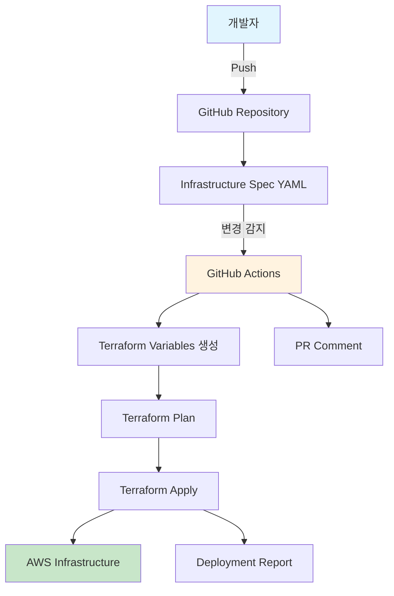

# 🚀 Terraform 자동화 배포 파이프라인 가이드

## 📋 개요

이 시스템은 개발자가 GitHub에 코드를 Push하면 자동으로 인프라를 구축하는 GitOps 기반 자동화 파이프라인입니다.

## 🏗️ 시스템 아키텍처



## 🔄 작동 방식

### 1. 인프라 요구사항 정의
`infra/requirements/infrastructure-spec.yml` 파일을 수정하여 원하는 인프라를 정의합니다.

### 2. 자동 감지 및 변환
- GitHub Actions가 YAML 파일 변경을 감지
- Python 스크립트가 YAML을 Terraform 변수로 자동 변환
- 변경사항을 자동으로 커밋

### 3. 인프라 배포
- Terraform Plan 실행 및 PR 코멘트
- 승인된 브랜치(main/develop)에서 자동 Apply
- 배포 결과 리포트 생성

## 📝 사용법

### 🎯 기본 사용법

1. **인프라 스펙 수정**
   ```bash
   # 인프라 요구사항 파일 편집
   vim infra/requirements/infrastructure-spec.yml
   ```

2. **변경사항 커밋 및 푸시**
   ```bash
   git add infra/requirements/infrastructure-spec.yml
   git commit -m "feat: Add new EC2 instance for monitoring"
   git push origin feature/add-monitoring
   ```

3. **자동 처리 확인**
   - GitHub Actions에서 자동 처리 확인
   - PR에서 Terraform Plan 결과 확인
   - 머지 후 자동 배포 실행

### 🛠️ 고급 사용법

#### 수동 배포 트리거
```bash
# GitHub CLI 사용
gh workflow run terraform-deploy.yml \
  -f environment=dev \
  -f action=apply
```

#### 특정 환경 배포
```yaml
# workflow_dispatch 이벤트로 수동 실행
environment: staging  # dev, staging, prod
action: plan         # plan, apply, destroy
```

## 📋 인프라 스펙 YAML 구조

### 🌐 네트워크 설정
```yaml
network:
  vpc:
    cidr: "10.30.0.0/16"
  subnets:
    public:
      - cidr: "10.30.10.0/24"
        az: "ap-northeast-2a"
```

### 🖥️ 컴퓨팅 리소스
```yaml
compute:
  ec2:
    management:
      instance_type: "t3.medium"
      ami: "ami-0d5bb3742db8fc264"
```

### ☸️ Kubernetes 클러스터
```yaml
kubernetes:
  eks:
    cluster_name: "kdt-dev-eks-cluster"
    version: "1.33"
    node_groups:
      main:
        scaling:
          desired_size: 2
          min_size: 1
          max_size: 3
```

### 🗄️ 데이터베이스
```yaml
database:
  rds:
    engine: "mysql"
    engine_version: "8.0.41"
    instance_class: "db.t3.micro"
```

## 🔒 보안 설정

### GitHub Secrets 설정
다음 시크릿을 GitHub Repository Settings에서 설정해야 합니다:

```
AWS_ACCESS_KEY_ID: AKIA...
AWS_SECRET_ACCESS_KEY: ...
```

### IAM 권한
GitHub Actions에서 사용할 IAM 사용자에게 다음 권한이 필요합니다:

```json
{
  "Version": "2012-10-17",
  "Statement": [
    {
      "Effect": "Allow",
      "Action": [
        "ec2:*",
        "eks:*",
        "rds:*",
        "iam:*",
        "s3:*",
        "secretsmanager:*",
        "kms:*"
      ],
      "Resource": "*"
    }
  ]
}
```

## 🚀 배포 전략

### 환경별 배포 정책

| 환경 | 자동 배포 | 승인 필요 | 승인자 |
|------|-----------|-----------|--------|
| dev | ✅ | ❌ | - |
| staging | ❌ | ✅ | kdt-team |
| prod | ❌ | ✅ | kdt-team, ops-team |

### 브랜치별 동작

| 브랜치 | 동작 |
|--------|------|
| `feature/*` | Plan만 실행, PR 코멘트 |
| `develop` | 자동 Apply (dev 환경) |
| `main` | 자동 Apply (prod 환경) |

## 📊 모니터링 및 알림

### GitHub Actions 결과
- ✅ **성공**: 배포 완료 알림
- ❌ **실패**: 오류 로그 및 롤백 가이드
- ⚠️ **부분 성공**: 수동 개입 필요

### 배포 리포트
각 배포 후 다음 정보가 포함된 리포트가 생성됩니다:
- 배포된 리소스 목록
- 변경사항 요약
- 비용 영향 분석
- 롤백 방법

## 🛠️ 문제 해결

### 일반적인 문제

#### 1. Terraform Plan 실패
```bash
# 로컬에서 검증
cd infra/dev/terraform
terraform init
terraform validate
terraform plan
```

#### 2. AWS 권한 오류
```bash
# IAM 권한 확인
aws sts get-caller-identity
aws iam get-user
```

#### 3. 리소스 충돌
```bash
# 기존 리소스 확인
aws ec2 describe-instances --filters "Name=tag:Project,Values=kdt"
```

### 긴급 롤백

#### 자동 롤백
```bash
# 이전 커밋으로 되돌리기
git revert HEAD
git push origin main
```

#### 수동 롤백
```bash
# 특정 리소스만 제거
gh workflow run terraform-deploy.yml \
  -f environment=dev \
  -f action=destroy
```

## 📈 성능 최적화

### 배포 시간 단축
- **병렬 처리**: 독립적인 리소스 동시 생성
- **캐싱**: Terraform 상태 및 플러그인 캐시
- **증분 배포**: 변경된 리소스만 업데이트

### 비용 최적화
- **자동 스케일링**: 시간대별 리소스 조정
- **스팟 인스턴스**: 개발 환경에서 비용 절약
- **리소스 태깅**: 비용 추적 및 할당

## 🔄 업데이트 및 유지보수

### 정기 업데이트
- **Terraform 버전**: 분기별 업데이트
- **AWS 프로바이더**: 월별 업데이트
- **GitHub Actions**: 보안 패치 즉시 적용

### 백업 전략
- **Terraform 상태**: S3 백엔드 자동 백업
- **인프라 스냅샷**: 주요 변경 전 스냅샷 생성
- **설정 백업**: Git 히스토리 기반 버전 관리

## 📚 추가 리소스

### 문서
- [Terraform 공식 문서](https://terraform.io/docs)
- [GitHub Actions 가이드](https://docs.github.com/actions)
- [AWS CLI 참조](https://docs.aws.amazon.com/cli/)

### 도구
- [Terraform 확장](https://marketplace.visualstudio.com/items?itemName=HashiCorp.terraform)
- [YAML 검증기](https://www.yamllint.com/)
- [AWS 비용 계산기](https://calculator.aws)

---

💡 **팁**: 인프라 변경 전에는 항상 `terraform plan`으로 변경사항을 미리 확인하세요!

🚀 **자동화의 힘**: 한 번 설정하면 코드 푸시만으로 전체 인프라가 자동 배포됩니다!
